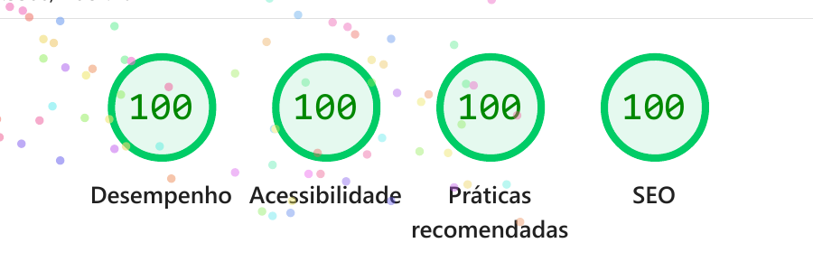
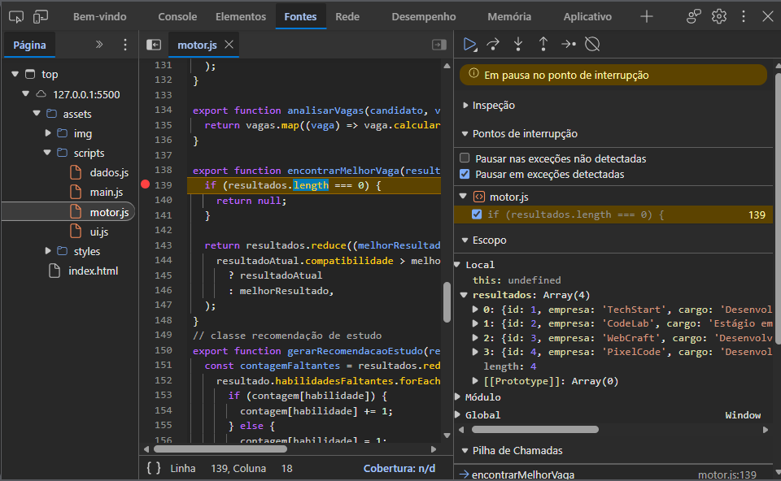

# 🎯 SkillMatch Web

> Descubra quais vagas combinam com o seu perfil e quais habilidades podem abrir novas oportunidades.

O **SkillMatch Web** é uma aplicação que compara as habilidades de uma pessoa candidata com os requisitos de vagas fictícias de Front-End.

A aplicação calcula o percentual de compatibilidade, apresenta habilidades encontradas e faltantes, classifica cada resultado e indica a vaga mais compatível. Também gera uma recomendação personalizada de estudo.

Tudo acontece em uma interface responsiva e acessível, desenvolvida com **HTML, CSS e JavaScript puro**.

---

## 📌 Sobre o projeto

Este projeto foi desenvolvido como parte do:

**Projeto Avaliativo — Módulo 01 — Semana 13**
**Curso: Desenvolvedor(a) Front-End React — Turmas 01 e 02**

Apesar do nome do curso, esta etapa utiliza somente HTML, CSS e JavaScript puro, sem React, TypeScript, frameworks ou ferramentas de build.

O projeto é uma evolução do primeiro **SkillMatch JS**, que funcionava no console. O motor de compatibilidade foi reaproveitado e adaptado para uma aplicação web de página única.

A versão original permanece disponível no arquivo `skillmatch.js` e na tag:

```text
v1.0.0-console
```

---

## 🧠 Problema proposto

Uma startup de recrutamento possui um motor que compara candidatos com vagas, mas o sistema funciona somente pelo console.

Para tornar a solução utilizável por candidatos e profissionais de recrutamento, foi necessário criar uma interface que:

- receba os dados do candidato por formulário;
- valide as informações;
- carregue as vagas de uma fonte externa ao HTML;
- apresente os resultados visualmente;
- funcione no celular e no computador;
- lembre o perfil entre diferentes acessos;
- trate situações de carregamento, catálogo vazio e falha na rede.

---

## ⚙️ O que o sistema faz

Ao acessar o SkillMatch Web, a aplicação:

1. recupera o perfil anteriormente salvo no navegador;
2. carrega quatro vagas do arquivo `vagas.json` usando `fetch`;
3. apresenta mensagens de carregamento, catálogo vazio ou erro;
4. recebe nome, área, habilidades e experiência pelo formulário;
5. valida os dados com mensagens acessíveis;
6. compara as habilidades do candidato com cada vaga;
7. calcula e classifica o percentual de compatibilidade;
8. separa as habilidades encontradas e faltantes;
9. identifica a vaga mais compatível;
10. gera uma recomendação de estudo;
11. cria os cards das vagas dinamicamente pelo DOM;
12. salva o perfil no `localStorage`.

---

## 🖥️ Exemplo de resultado

Exemplo de perfil informado:

```text
Nome: Paulo
Área: Front-End
Habilidades: HTML, CSS, JavaScript, GitHub
Experiência: 3 meses
```

Resultado apresentado pela aplicação:

```text
Melhor oportunidade:
TechStart - Desenvolvedor Front-End Júnior

Compatibilidade: 100%
Classificação: Alta compatibilidade

Habilidades encontradas:
HTML, CSS, JavaScript, GitHub

Habilidades faltantes:
Nenhuma
```

Além da melhor oportunidade, a aplicação apresenta os cards das quatro vagas e uma recomendação baseada nas habilidades que ainda faltam no perfil.

---

## 📊 Regras de compatibilidade

O percentual é calculado pela seguinte regra:

```text
habilidades encontradas ÷ total de requisitos da vaga × 100
```

| Percentual | Classificação         |
| ---------- | --------------------- |
| 80% a 100% | Alta compatibilidade  |
| 50% a 79%  | Média compatibilidade |
| 0% a 49%   | Baixa compatibilidade |

Em caso de empate, o sistema mantém a primeira vaga com o maior percentual encontrada no catálogo.

As comparações ignoram diferenças entre letras maiúsculas e minúsculas. Assim, `javascript` e `JavaScript` são reconhecidos como a mesma habilidade.

---
## 📁 Estrutura do projeto

```text
skillmatch-js/
├── index.html
├── README.md
├── skillmatch.js
├── assets/
│   ├── dados/
│   │   └── vagas.json
│   ├── img/
│   │   └── logo.svg
│   ├── scripts/
│   │   ├── dados.js
│   │   ├── main.js
│   │   ├── motor.js
│   │   └── ui.js
│   └── styles/
│       └── index.style.css
└── planejamento/
    └── tarefas-kanban.md
```

### Responsabilidade dos arquivos

* `index.html`: estrutura semântica e acessível da página;
* `index.style.css`: estilos, Flexbox e responsividade mobile-first;
* `main.js`: ponto de entrada e coordenação do fluxo da aplicação;
* `motor.js`: classes e regras de compatibilidade do SkillMatch;
* `ui.js`: formulário, validação e criação dos elementos no DOM;
* `dados.js`: carregamento das vagas e persistência do perfil;
* `vagas.json`: catálogo com quatro vagas fictícias;
* `logo.svg`: identidade visual utilizada no cabeçalho;
* `skillmatch.js`: versão original do projeto executada no console;
* `tarefas-kanban.md`: registro do planejamento inicial.

A separação entre `dados`, `motor`, `ui` e `main` mantém as responsabilidades organizadas e demonstra o uso de módulos ES com `import` e `export`.

---

## ▶️ Como executar

Como o projeto utiliza módulos ES e `fetch`, ele deve ser executado por um servidor local. Abrir o `index.html` diretamente pelo endereço `file://` pode impedir o carregamento das vagas.

### Execução pelo VS Code

1. Clone o repositório:

```bash
git clone https://github.com/PauloFilartiga/skillmatch-js.git
```

2. Entre na pasta:

```bash
cd skillmatch-js
```

3. Abra o projeto no VS Code:

```bash
code .
```

4. Abra o arquivo `index.html`.
5. Inicie o projeto com o **Live Server**.
6. Acesse o endereço exibido no navegador, normalmente:

```text
http://127.0.0.1:5500/
```

A aplicação não precisa de banco de dados, back-end, instalação de pacotes ou Node.js para funcionar.

---
## ✅ Requisitos funcionais implementados

| Requisito | Implementação                                                                                  |
| --------- | ---------------------------------------------------------------------------------------------- |
| RF01      | Perfil do candidato representado por objeto com nome, área, habilidades e experiência em meses |
| RF02      | Catálogo com quatro vagas carregadas do arquivo `vagas.json`                                   |
| RF03      | Cálculo do percentual e separação das habilidades encontradas e faltantes                      |
| RF04      | Classificação em compatibilidade alta, média ou baixa                                          |
| RF05      | Identificação da melhor vaga e geração de recomendação de estudo                               |
| RF06      | Uso de `map`, `filter`, `reduce`, `forEach`, `includes` e outros métodos de array              |
| RF07      | Classes `Vaga` e `VagaFrontEnd`, com construtor, `this`, herança e sobrescrita de método       |
| RF08      | Callback para a mensagem final e closure para o contador de análises                           |
| RF09      | HTML semântico, acessibilidade, imagem com `alt`, título e descrição para SEO                  |
| RF10      | Formulário com `addEventListener`, `preventDefault` e validação acessível                      |
| RF11      | Cards criados dinamicamente com `createElement` e `classList`                                  |
| RF12      | Layout mobile-first, Flexbox, unidades fluidas e media query                                   |
| RF13      | `fetch` com `async/await`, `try/catch`, `response.ok` e estados de carregamento, vazio e erro  |
| RF14      | Perfil persistido com `localStorage`, `JSON.stringify`, `JSON.parse` e tratamento do `null`    |
| RF15      | JavaScript separado em módulos ES com `import` e `export`                                      |
| RF16      | Uso consciente do debugger para investigar o fluxo dos resultados                              |

---

## 🧩 Conceitos utilizados

O projeto reúne conteúdos estudados durante o Módulo 01:

* tipos primitivos;
* operadores matemáticos e lógicos;
* estruturas condicionais;
* funções tradicionais e arrow functions;
* arrays e objetos;
* métodos de array;
* classes, construtores, métodos e `this`;
* herança e sobrescrita de comportamento;
* callback e closure;
* Promises e `async/await`;
* tratamento de erros com `try/catch`;
* módulos ES com `import` e `export`;
* manipulação do DOM;
* eventos de formulário;
* validação acessível;
* `fetch`;
* `localStorage`;
* HTML semântico e SEO;
* CSS externo, Flexbox e responsividade mobile-first.

---

## 🔎 Métodos de array utilizados

### `map`

Transforma as vagas carregadas do JSON em instâncias da classe `VagaFrontEnd` e gera um resultado de compatibilidade para cada vaga.

```javascript
export function analisarVagas(candidato, vagas) {
  return vagas.map((vaga) => vaga.calcularCompatibilidade(candidato));
}
```

### `filter`

Separa os requisitos em dois grupos:

* habilidades encontradas no perfil;
* habilidades que ainda estão faltando.

A comparação normaliza os textos para que diferenças entre letras maiúsculas e minúsculas não alterem o resultado.

### `reduce`

Percorre os resultados e mantém aquele que possui o maior percentual de compatibilidade.

```javascript
export function encontrarMelhorVaga(resultados) {
  if (resultados.length === 0) {
    return null;
  }

  return resultados.reduce((melhorResultado, resultadoAtual) =>
    resultadoAtual.compatibilidade > melhorResultado.compatibilidade
      ? resultadoAtual
      : melhorResultado,
  );
}
```

O `reduce` também é utilizado para contar quais habilidades faltantes aparecem com maior frequência.

Outros métodos utilizados:

* `forEach`;
* `includes`;
* `every`;
* `join`;
* `split`;
* `Object.entries`.

---

## 🏗️ Programação Orientada a Objetos

A classe `Vaga` representa os dados e comportamentos comuns das oportunidades:

* identificador;
* empresa;
* cargo;
* requisitos;
* salário;
* modalidade;
* experiência mínima;
* resumo da vaga;
* cálculo de compatibilidade.

O método de cálculo utiliza `this.requisitos`, demonstrando que cada instância analisa seus próprios requisitos.

A classe `VagaFrontEnd` herda de `Vaga` e acrescenta:

* stack;
* senioridade;
* resumo específico para oportunidades de Front-End;
* informações complementares no resultado da análise.

A herança possui um propósito claro: manter as características gerais de qualquer vaga na classe principal e concentrar os dados específicos de Front-End na subclasse.

Os objetos recebidos pelo `fetch` são transformados em instâncias da classe com `map`:

```javascript
const vagasCarregadas = criarVagasFrontEnd(dadosVagas);
```

Assim, os dados do arquivo JSON passam a utilizar os métodos definidos no motor da aplicação.

---
## 🔁 Callback

Um callback é uma função enviada para outra função executar.

No SkillMatch, `finalizarAnalise` recebe o nome do candidato e uma função de callback:

```javascript
export function finalizarAnalise(nomeCandidato, callback) {
  return callback(nomeCandidato);
}
```

No `main.js`, uma arrow function é enviada como argumento para criar a mensagem final:

```javascript
const mensagemFinal = finalizarAnalise(candidato.nome, (nome) => {
  return `${nome}, análise ${numeroAnalise} concluída. Confira os resultados abaixo.`;
});
```

A função `finalizarAnalise` controla quando o callback será executado.

---

## 🔒 Closure

A closure preserva o valor do contador enquanto a página permanece aberta:

```javascript
export function criarContadorDeAnalises() {
  let total = 0;

  return function contarAnalise() {
    total += 1;

    return total;
  };
}
```

A função interna continua acessando a variável `total` mesmo depois que `criarContadorDeAnalises` terminou sua execução.

Cada envio válido do formulário aumenta o contador:

```text
Análise número: 1 nesta sessão
Análise número: 2 nesta sessão
Análise número: 3 nesta sessão
```

Ao atualizar a página, uma nova sessão é iniciada e o contador volta para zero.

---

## 🌐 Fetch, Promise e async/await

As vagas são carregadas de `assets/dados/vagas.json` por uma requisição real com `fetch`:

```javascript
export async function carregarVagas() {
  const resposta = await fetch("./assets/dados/vagas.json");

  if (!resposta.ok) {
    throw new Error(
      `Não foi possível carregar as vagas. Status: ${resposta.status}`,
    );
  }

  const vagas = await resposta.json();

  if (!Array.isArray(vagas)) {
    throw new Error("O catálogo de vagas não está no formato esperado.");
  }

  return vagas;
}
```

O `fetch` devolve uma Promise. O `await` aguarda a resposta antes de continuar e o `try/catch` trata possíveis falhas.

A interface apresenta os estados:

* **carregando:** informa que as vagas estão sendo buscadas;
* **vazio:** informa que nenhuma vaga foi encontrada;
* **erro:** apresenta uma mensagem clara quando a requisição falha;
* **sucesso:** informa quantas vagas foram carregadas.

As mensagens são anunciadas por um elemento com `aria-live`, permitindo que tecnologias assistivas percebam as alterações.

---
## 🖧 Fluxo cliente-servidor

No SkillMatch Web, o navegador funciona como cliente e solicita o catálogo de vagas ao servidor local iniciado pelo Live Server.

O fluxo acontece assim:

1. o navegador carrega o `index.html`;
2. o `main.js` inicia a aplicação;
3. o `dados.js` executa o `fetch`;
4. o servidor local responde com o arquivo `vagas.json`;
5. os dados são convertidos em objetos JavaScript;
6. o motor calcula a compatibilidade;
7. a interface apresenta os resultados.

O projeto não possui back-end ou banco de dados. O servidor local é utilizado apenas para disponibilizar corretamente os arquivos, os módulos ES e a resposta do `fetch`.

---

## 💾 Persistência com localStorage

O perfil validado é salvo no navegador com `localStorage`:

```javascript
export function salvarPerfil(perfil) {
  const perfilEmTexto = JSON.stringify(perfil);

  localStorage.setItem("skillmatch-perfil", perfilEmTexto);
}
```

Como o `localStorage` armazena texto, `JSON.stringify` converte o objeto antes do salvamento.

Na próxima visita, `JSON.parse` transforma o texto novamente em objeto. A aplicação também trata o `null` da primeira visita e remove conteúdos inválidos para evitar erros.

São armazenados somente:

* nome;
* área de interesse;
* habilidades;
* experiência em meses.

Nenhum dado sensível, senha ou token é salvo.

---

## 📦 Módulos ES

O JavaScript foi separado conforme a responsabilidade de cada módulo:

| Módulo     | Responsabilidade                                  |
| ---------- | ------------------------------------------------- |
| `main.js`  | Coordena o fluxo da aplicação                     |
| `motor.js` | Contém classes e regras de compatibilidade        |
| `ui.js`    | Controla formulário, mensagens e elementos do DOM |
| `dados.js` | Carrega as vagas e persiste o perfil              |

Os arquivos compartilham funções e classes com `import` e `export`. No HTML, o ponto de entrada é carregado com:

```html
<script type="module" src="./assets/scripts/main.js"></script>
```

---

## 🖱️ DOM, eventos e validação

O formulário utiliza:

* `addEventListener` para reagir ao envio;
* `preventDefault` para impedir o recarregamento automático;
* `trim`, `split`, `map` e `filter` para tratar os valores;
* `aria-invalid` para indicar campos incorretos;
* mensagens associadas por `aria-describedby`;
* `focus()` para levar o teclado ao primeiro campo inválido.

Os cards não estão escritos manualmente no HTML. Eles são criados pelo JavaScript com:

* `document.createElement`;
* `classList.add`;
* `textContent`;
* `appendChild`.

---

## 🐞 Depuração consciente

Durante o desenvolvimento, a função `encontrarMelhorVaga` apresentou uma diferença entre os nomes `resultado` e `resultados`.

O navegador interpretou `resultados` como o elemento HTML que possuía `id="resultados"`. Como um elemento HTML não possui o método `reduce`, foi apresentado o erro:

```text
resultados.reduce is not a function
```

Após corrigir o parâmetro, foi utilizado um breakpoint no DevTools dentro de `encontrarMelhorVaga`.

O debugger permitiu confirmar que:

* `resultados` era um `Array(4)`;
* cada posição continha uma vaga analisada;
* o `reduce` recebeu o tipo de dado correto;
* o fluxo continuou normalmente após a correção.

Essa verificação substituiu o uso de vários `console.log` espalhados pelo código.

---

## ♿ Acessibilidade e SEO

A aplicação utiliza:

* landmarks semânticos;
* um único `h1`;
* hierarquia de títulos;
* `label` associado aos campos;
* textos alternativos;
* foco visível;
* mensagens com `aria-live`;
* idioma `pt-BR`;
* título descritivo;
* meta description;
* layout responsivo.

Na auditoria mobile do Lighthouse, a aplicação alcançou:

| Categoria | Resultado |
| --- | --- |
| Desempenho | 100 |
| Acessibilidade | 100 |
| Boas práticas | 100 |
| SEO | 100 |

---
## 📸 Evidências de validação
Resultado do Lighthouse



Uso do debugger



---
## 🔤 Uso de `const`, `let` e escopo

O projeto prioriza `const` para referências que não recebem uma nova atribuição.

`let` é utilizado somente quando o valor precisa mudar, por exemplo:

* `vagasCarregadas`, que recebe as instâncias depois do `fetch`;
* `formularioValido`, alterado durante a validação;
* `total`, preservado pela closure entre diferentes análises.

A palavra `var` não foi utilizada por possuir escopo de função e permitir comportamentos menos previsíveis.

As variáveis declaradas dentro das funções permanecem limitadas aos seus respectivos escopos, evitando conflitos com outras partes da aplicação.

---
## 🛠️ Tecnologias e ferramentas

### Tecnologias da aplicação


### Desenvolvimento e versionamento


### Testes e organização


O Live Server foi utilizado para executar a aplicação localmente, permitindo o funcionamento dos módulos ES e do `fetch`.

---

## 🌿 Estratégia de versionamento

O desenvolvimento seguiu o fluxo:

```text
feature, fix, chore ou docs
            ↓
         develop
            ↓
           main
```

* `main`: versão estável e pronta para entrega;
* `develop`: integração das funcionalidades;
* `feat/*`: novas funcionalidades;
* `fix/*`: correções;
* `chore/*`: organização e preparação;
* `docs/*`: documentação.

Cada funcionalidade foi desenvolvida em uma branch própria, testada e integrada à `develop` por Pull Request.

### Branches da versão web

* `chore/estrutura-web`;
* `feat/estrutura-html`;
* `feat/layout-responsivo`;
* `feat/catalogo-vagas`;
* `feat/motor-web`;
* `feat/callback-closure`;
* `feat/fetch-vagas`;
* `feat/formulario-perfil`;
* `feat/render-resultados`;
* `feat/persistencia-perfil`;
* `docs/readme-web`.

A versão anterior executada no console foi preservada pela tag:

```text
v1.0.0-console
```

As branches não foram excluídas após os merges, mantendo visível a evolução do projeto.

---
## 📋 Organização pelo Kanban

As tarefas foram organizadas no Notion com as colunas:

* Backlog;
* A Fazer;
* Em Andamento;
* Feito.

O fluxo utilizado em cada etapa foi:

1. selecionar um cartão;
2. criar uma branch a partir da `develop`;
3. implementar uma parte da funcionalidade;
4. testar o comportamento;
5. validar o código;
6. criar commit e enviar a branch;
7. abrir uma Pull Request;
8. realizar o merge na `develop`;
9. mover o cartão para Feito.

🔗 **Quadro Kanban:**
https://app.notion.com/p/99b5701753e8837db74281f757753b14?v=5865701753e88272a2f208cd9a2f61d0&source=copy_link

---

## 🤖 Uso de inteligência artificial

A inteligência artificial foi utilizada como ferramenta de apoio durante algumas etapas do desenvolvimento, principalmente para:

* organizar partes mais extensas do motor;
* revisar funções de renderização;
* investigar mensagens de erro;
* sugerir testes de acessibilidade e responsividade;
* auxiliar na organização da documentação.

Todos os trechos foram revisados antes de serem aceitos. A aplicação foi testada no navegador, os erros encontrados foram corrigidos e foram mantidas somente técnicas compatíveis com o Módulo 01.

Não foram utilizados React, TypeScript, frameworks, bibliotecas externas, ferramentas de build, back-end ou banco de dados.

---

## 🎥 Vídeo de apresentação

O vídeo da versão web será gravado após a conclusão de todas as etapas do projeto.

O link será adicionado aqui antes da entrega no AVA.

<details>
<summary><strong>Vídeo da versão original executada no console</strong></summary>

[▶️ Assistir à apresentação da versão de console](https://youtu.be/VVkW4e5Wzr0)

</details>

---

## 🚀 Possíveis melhorias futuras

Em versões futuras, o projeto poderá receber:

* filtro por modalidade;
* ordenação por salário ou compatibilidade;
* tema claro e escuro;
* comparação entre experiência do candidato e experiência mínima da vaga;
* consumo de uma API pública de vagas;
* armazenamento do histórico de análises;
* testes automatizados;
* uma nova versão desenvolvida com React no Módulo 02.

---

## 👨‍💻 Autor

**Paulo Filartiga**

Estudante de Engenharia de Software e desenvolvedor em formação, com interesse em desenvolvimento web, JavaScript, arquitetura de software e boas práticas de versionamento.

🔗 **GitHub:**
https://github.com/PauloFilartiga

---

## 💬 Considerações finais

O SkillMatch Web transformou um motor executado no console em uma aplicação acessível, responsiva e persistente.

O projeto demonstra como HTML, CSS e JavaScript podem trabalhar em conjunto com organização de código, consumo de dados, manipulação do DOM, tratamento de erros, versionamento e documentação.

> Toda habilidade já aprendida aproxima o candidato de uma oportunidade. Toda habilidade faltante indica o próximo passo.
